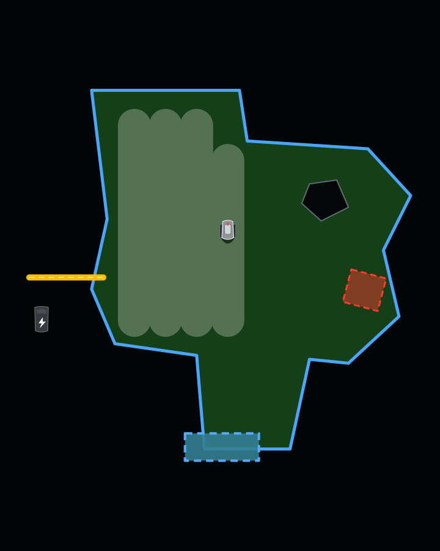

# Eufy Robomow — Home Assistant Integration

A Home Assistant custom integration for the **Eufy E15** robotic lawn mower. The design is capability-driven for possible E18 support, but E18 support is not yet hardware-validated or claimed.

Control and monitor your Eufy mower directly from Home Assistant over your local network, with cloud-synced settings pulled straight from your Eufy account — no extra tools or manual key extraction required.

GitHub is the development source and issue tracker for this fork. Version 0.7.0
adds a dedicated dashboard card, observed session history, confirmed commands
and an optional Home Assistant planning package. Version 0.8.0 adds an optional
mower backend that reads state from the dedicated mower bridge. Version 0.8.1
corrects the Signal Strength sensor to the percentage the mower declares.
Version 0.8.2 reports the confirmed E15 activity in bridge mode.

---

## Features

| Entity | Type | Description |
|--------|------|-------------|
| Mower | `lawn_mower` | Activity state; start, pause, and dock after control is explicitly enabled |
| Battery | `sensor` | Battery level (%) |
| Mowed Area | `sensor` | Area covered in the current or last session |
| Mowing Progress | `sensor` | Real-time session completion % (from DP113 telemetry blob) |
| Return Progress | `sensor` | Return-to-base progress (%) |
| Session Distance | `sensor` | Distance traveled in the current session (m) |
| Network | `sensor` | WiFi / Cellular connection type |
| Signal Strength | `sensor` | WiFi signal strength (%), the mower's own declared percentage |
| Cut Height | `number` | Blade height 25–75 mm, step 5 mm (local, instant) |
| Volume | `number` | Speaker volume 0–100 % (local) |
| Edge Distance | `number` | −15 to +15 cm — how far inside/outside the border wire the mower cuts |
| Pad Direction | `number` | Mowing path angle 0–359° |
| Travel Speed | `select` | Mower driving speed: slow / normal / fast |
| Blade Speed | `select` | Blade motor speed: slow / normal / fast |
| Path Distance | `select` | Lane spacing: 8 cm / 10 cm / 12 cm |
| Stop on Rain | `switch` | Pause mowing when rain is detected |
| Child Protection | `switch` | Enable child/pet protection mode |
| Smart No-Go Suggestions | `switch` | AI-assisted no-go zone suggestions |
| Mow Yellow Grass | `switch` | Allow mowing on dry/yellow grass |
| Map | `image` | Optional read-only E15 boundary, areas, pathways, mower and cleaning path |

> **Cloud entities** (edge distance, pad direction, speeds, path distance) require your Eufy account credentials. They are polled every 5 minutes and written back via the Tuya mobile API.
>
> Some entities (generic raw DP sensors, map coverage) are **disabled by default** — enable them in HA if you want to explore unconfirmed data points.

### Map preview

<p align="center">
  
</p>

The map image follows the live mowing session with two-second, change-aware
updates. It shows the mapped boundary, charging area, external pathways, no-go
areas, completed mowing lanes and the latest mower position. The preview above
uses synthetic geometry; no private lawn map or device data is stored in this
repository.

---

## Prerequisites

- **Local network access** — the mower and Home Assistant must be on the same LAN (or the mower reachable via IP).
- **Eufy account** — required for cloud-managed settings. The same email/password you use in the Eufy Home app.
- Home Assistant **2026.7** or newer during private alpha development.

---

## Installation

### Private development installation

1. Copy the `custom_components/eufy_robomow/` folder into your HA `config/custom_components/` directory
2. Restart Home Assistant

HACS packaging is intentionally deferred until the private integration has passed protocol, safety, and reliability validation.

---

## Configuration

Go to **Settings → Devices & Services → Add Integration → Eufy Robomow**.

**Step 1 — Sign in:**
Enter your Eufy account email and password. The integration will automatically discover all your devices and fetch their local keys.

**Step 2 — Select mower:**
Pick your mower from the dropdown and enter its local IP address (find it in your router's DHCP table or the Eufy app's device info screen).

That's it — no external tools, no manual key extraction.

New entries start in **observe-only** mode. Entries upgraded from the original
integration also start in observe-only when they do not yet have an explicit
operating mode. In this mode the mower entity reports state, but physical
commands and settings-write entities are disabled. After supervised read-only
validation, use **Settings → Devices & Services → Eufy Robomow → Configure** to
opt in to control.

> **Alpha credential notice:** the current cloud client still stores the Eufy account password in the Home Assistant config entry so it can renew sessions. Restrict access to Home Assistant backups and `.storage`; replacing this with renewable session material is tracked as a separate hardening change.

### Mower backend

**Settings → Devices & Services → Eufy Robomow → Configure** offers a
**Mower backend** choice. Exactly one backend owns the mower.

- **local** (default, unchanged): this integration polls the mower over the
  Tuya local protocol and, with account credentials, polls cloud settings.
  Existing entries keep this backend until you change it.
- **bridge**: the integration reads state from the dedicated mower bridge
  described below and creates no local connection and no cloud client of its
  own. Enter the bridge URL (`http` or `https`, for example
  `http://127.0.0.1:8090`), its bearer token, and optionally the mower id and
  a certificate fingerprint for a private TLS certificate. Saving validates the
  token against the bridge and fills in the mower id when the bridge discovers
  exactly one mower.

In bridge mode the mower entity, battery, network and signal sensors read the
bridge's typed state every ten seconds. `telemetry_updated_at` is the bridge's
observation time, not the poll time. When the bridge reports stale data, an
error or is unreachable, the entities become unavailable, exactly as after a
failed local poll. Nothing is carried forward.

Bridge mode is state only today. It exposes no mower controls and creates no
settings entities, whatever the operating mode, and a write raises a clear
error. Bridge 0.5.0 offers opt-in start, pause and resume routes, which the
integration does not use yet (issue #22). Session history does not grow in bridge mode. Activity comes from the
library's typed status. With bridge 0.4.0 on library 0.15.0 the mower entity
reports mowing, paused and returning from the confirmed DP 107 payloads, with
`telemetry_updated_at` as the observation time. The `bridge_status` attribute
shows the library's status state: `reported`, `missing` when the query carried
no DP 107, `invalid` for a withheld payload, or `unconfirmed`. A missing or
invalid status leaves the activity unknown. No E15 payload identifies docked,
charging, idle or error yet, so the entity never shows docked in bridge mode
and nothing is inferred from age, absence or inactivity. Mowing progress stays
unconfirmed. See [DP 107 activity](docs/protocol-provenance.md#dp-107-activity).
Entity unique IDs are unchanged, so switching back and forth never
duplicates or renames entities and no command is replayed on a switch.

### Mower dashboard and session history

1. Install the integration and restart Home Assistant.
2. Add `/eufy_robomow/eufy-mower-card.js?v=0.7.1` as a JavaScript module under
   **Settings → Dashboards → Resources** (advanced mode may be needed).
3. Create a dashboard, enable its sidebar entry, and use
   [`examples/dashboard.yaml`](examples/dashboard.yaml). Replace entity IDs with
   those from your installation. The example uses four native Home Assistant tabs:
   mower, history, planning and settings. Cards follow the active HA theme, like
   the Eufy Viewer dashboard. The card also works in an existing dashboard.

Set `view` to `overview`, `history`, `planning` or `settings` to show one section.
Omitting it keeps the combined view for existing cards. Frontend version 0.7.1
changes presentation only; it does not add zone commands or enable planning.

The card supports map zoom/pan, battery and session telemetry, settings, and
start/resume, pause and return commands. It shows pending, confirmed, failed and
uncertain results. Start requires confirmation; unavailable or stale telemetry
and observe-only mode disable controls. An inactive-task response to Return is
not proof of physical arrival at the dock.

Fifty observed session summaries are stored privately in Home Assistant; the
card shows the latest twenty. Pauses and telemetry gaps remain visible, and a
restart does not invent missing mowing time. Area remains in raw units until the
scale is validated. Existing lifetime counters are not reconstructed as sessions.
The optional map source described below is still required for map display.

### Optional rain-aware planning

[`examples/eufy_mower_planning.yaml`](examples/eufy_mower_planning.yaml) is an
opt-in Home Assistant package. Replace every `example_*` source and mower entity
with your own. It expects the documented Buienalarm precipitation-array shape
and separate irrigation valve, active-session, planned-session and start-time
entities. Missing or stale sources block automatic starts.

The package offers weekday and time-window selection, minimum battery, dry hold
and maximum session duration. It checks radar coverage for the whole planned
session, irrigation conflicts, daylight and onboard rain/child protection. It
allows at most one start attempt per day. Its watchdog handles only sessions it
started, issuing one pause or return request without automatic retries/resume.
Automatic mowing initially stays off; configure and supervise validation before
enabling it. Eufy-app schedules run independently and must be considered separately.

### Optional read-only map

E15 maps use a separate Tuya P2P media transport that is not available through
the mower's normal local DPS connection. This integration can consume a
compatible map source without bundling that transport or its Android-only
vendor libraries.

Configure the source under **Settings → Devices & Services → Eufy Robomow →
Configure**:

- **Map source HTTPS URL** — base URL of the map source.
- **Certificate SHA-256 fingerprint** — optional pin for private or self-signed
  TLS. Normal certificate validation is used when this is empty.

Authentication is derived from the mower's existing local key; no additional
token is stored. The source must expose `GET /v1/map` with content type
`application/vnd.eufy-robomow-map+zip`, support `ETag` responses, and use the
`X-Eufy-Map-Mode` request header (`idle` or `stream`) to control its read-only
P2P session. The stored ZIP contains a manifest and exactly these three files:

- `map.bin.stream`
- `cleanPath.bin.stream`
- `navPath.bin.stream`

Home Assistant validates the archive, device binding, sizes, hashes, protobuf
and boundary before displaying it. One latest-good bundle is stored privately
under `/config/eufy_robomow_maps/`. If acquisition fails, the previous valid map
remains available. Idle maps refresh every five minutes. During an active mowing
task, Home Assistant requests changed stream snapshots every two seconds,
accumulates and deduplicates coverage deltas, and renders the newest mower pose.
Clear the source URL to remove the map entity; no mower setting or geometry is
changed.

Map bundles contain private lawn geometry. Never commit them, attach them to an
issue or include them in diagnostics.

---

## Mower bridge (foundation)

[`bridge/`](bridge/README.md) contains the dedicated Node 24 mower bridge that
later steps connect to this integration. It consumes
[`@keesmod/eufy-mega-client`](https://github.com/keesmod/eufy-mega-client)
0.16.0 as a library, pinned to the exact release tarball, and instantiates only
the library's mower module. It has its own token, credentials, session file,
data directory, port and lifecycle, and runs with no camera bridge present.

Version 0.5.0 validates its configuration, keeps one private session, makes one
explicit authentication attempt without retries and stops cleanly on `SIGTERM`.
Its read-only routes are `GET /v1/state`, `GET /v1/mowers` for the discovered
E15 mowers and `GET /v1/mowers/{id}/state` for one typed local query over the
LAN with explicit freshness and stale last-good results. Battery, network,
signal and the E15 activities mowing, paused and returning are confirmed in
the library today, see [DP 107 activity](docs/protocol-provenance.md#dp-107-activity).
No E15 payload identifies docked, charging, idle or error and mowing progress
stays unconfirmed. It starts in `observe_only` by default, where every command
route answers `403`. With `operating_mode: control` and a required stop route
it adds `POST /v1/mowers/{id}/commands/{start|pause|resume}`, each checked on
the bridge for mode, class, mower, host, exclusive ownership and the age of the
last state observation, and served as the library's confirmed, failed or
uncertain outcome without retry or replay. `return` stays unsupported until
the library has a route the owned firmware honours. No settings or map routes.
The Python integration consumes it through the optional **bridge** mower
backend described above, for state only. It ships as a reproducible container image and as a
local Home Assistant app candidate with a health check, see the
[deployment guide](docs/bridge-deployment.md). The follow-up order is recorded
in [issue #12](https://github.com/keesmod/eufy-robomow-ha/issues/12). See
[ADR 0003](docs/architecture/0003-dedicated-mower-bridge.md).

---

## How it works

- **Local polling** (every 10 s) via the [Tuya local protocol](https://github.com/jasonacox/tinytuya) for real-time status (battery, activity state, etc.). With the **bridge** backend the mower bridge polls the mower instead and Home Assistant reads its typed state every 10 s over an authenticated private HTTP connection.
- **Cloud polling** (every 5 min) via the Tuya mobile API for settings stored as protobuf blobs in DP155.
- **Writes**, when control is explicitly enabled, go to either the local mower or the cloud API depending on the setting.
- **Optional map acquisition** uses five-minute idle snapshots and two-second
  `ETag`-aware live pulls while mowing, then renders the validated geometry
  locally as a script-free SVG.

Runtime dependencies are pinned to the versions validated with Home Assistant
2026.7.1 and the E15's Tuya 3.5 transport. `requests` is declared directly;
TinyTuya remains pinned to 1.20.0 until another version passes the same local
protocol tests.

---

## Upgrade notes

- **0.8.2, bridge activity.** With mower bridge 0.4.0 on library 0.15.0 the
  bridge backend reports mowing, paused and returning from the confirmed E15
  payloads and adds the `bridge_status` attribute. Docked, charging, idle and
  error have no confirmed payload, so the entity stays unknown between tasks
  in bridge mode. The local backend is unchanged.
- **0.8.1, Signal Strength unit.** DP 109 is declared by the mower as a
  percentage from 0 to 100. Earlier versions negated the value and labelled it
  dBm without evidence. The sensor keeps its entity id and now reports the
  percentage. Home Assistant detects the changed unit of the sensor's
  long-term statistics and offers a repair to update or clear the old
  statistics. Automations that compared the value against negative dBm
  thresholds need the percentage instead.

## Known limitations

- **Zone mowing** — the owned E15 app shows Entire, Zone, Box and Spot, but area identifiers and command transport have not been validated. No zone action is exposed; see [zone research](docs/zone-control-research.md).
- **Map acquisition** — experimental and requires a separate compatible source because Tuya publishes the required P2P transport only through its Android media stack.
- **Live marker semantics** — the live mower/station interpretation matches repeated E15 observations but is not a vendor-documented protocol contract. It is display-only and never drives mower control.

---

## Troubleshooting

- **Entities unavailable** — check that the IP address is correct and the mower is on WiFi (not cellular only).
- **Cloud settings not updating** — cloud data refreshes every 5 minutes; changes made in the Eufy app will appear after the next refresh cycle.
- Enable **debug logging** for detailed output:

```yaml
# configuration.yaml
logger:
  logs:
    custom_components.eufy_robomow: debug
```

---

## Credits

Authentication and local-key discovery based on [eufy-clean-local-key-grabber](https://github.com/albaintor/eufy-clean-local-key-grabber).
Local protocol via [tinytuya](https://github.com/jasonacox/tinytuya).
