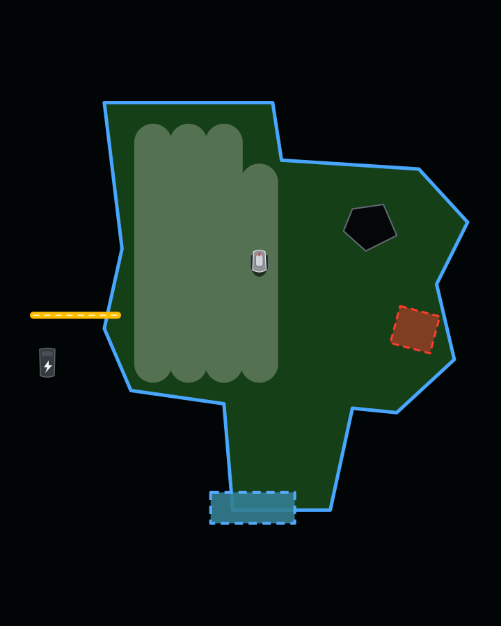

# Eufy Robomow for Home Assistant

[](https://github.com/keesmod/eufy-robomow-ha/actions/workflows/ci.yml)

A Home Assistant custom integration for the **Eufy E15** robotic lawn mower,
with an optional dedicated mower bridge. It reads the mower over your local
network, pulls the cloud-managed settings from your Eufy account and, once you
opt in, controls the mower with confirmed commands.

> [!IMPORTANT]
> **Private alpha.** Only the Eufy E15 is supported. The design anticipates the
> E18, but E18 support is not hardware-validated. Nothing is published as a
> release or through HACS. New installations start read only (`observe_only`).

<p align="center">
  
</p>
<p align="center"><sub>Map preview with synthetic geometry. No private lawn map or device data is stored in this repository.</sub></p>

## Features

- **Local status** every 10 seconds over the Tuya local protocol, with no
  manual key extraction. Sign-in discovers the mower and its local key.
- **Cloud settings** such as edge distance, path angle and speeds, read every
  5 minutes in daylight and written back through the Tuya mobile API.
- **Safe control.** Start, pause, resume, dock and setting writes appear only
  after an explicit opt-in. Each command is sent once and ends as confirmed,
  rejected or failed, or stays unconfirmed: `timeout` on the local backend and
  `uncertain` on the bridge. An unconfirmed command is never repeated
  automatically.
- **Live read-only map** with boundary, no-go zones, obstacles, pathways,
  mowing lanes and the mower position, updated every two seconds while mowing.
- **Dashboard card and session history** with fifty observed sessions stored
  privately in Home Assistant.
- **Optional rain-aware planning** as a Home Assistant package.
- **Optional mower bridge**, a dedicated Node 24 service that can own the mower
  instead of Home Assistant.

## Entities

| Entity | Type | Description |
|--------|------|-------------|
| Mower | `lawn_mower` | Activity state, and start, pause and dock after control is enabled |
| Battery | `sensor` | Battery level (%) |
| Mowed Area | `sensor` | Area covered in the current or last session |
| Mowing Progress | `sensor` | Session completion (%) from the DP 113 telemetry |
| Return Progress | `sensor` | DP 118, the map-save progress (%) at the dock arrival and after a Stop |
| Session Distance | `sensor` | Distance travelled in the current session (m) |
| Network | `sensor` | Wi-Fi or cellular connection type |
| Signal Strength | `sensor` | Wi-Fi signal strength (%) as the mower declares it |
| Cut Height | `number` | Blade height 25 to 75 mm in 5 mm steps |
| Volume | `number` | Speaker volume 0 to 100 % |
| Edge Distance | `number` | −15 to +15 cm, how far inside or outside the border wire the mower cuts |
| Pad Direction | `number` | Mowing path angle 0 to 359° |
| Travel Speed | `select` | Driving speed: slow, normal or fast |
| Blade Speed | `select` | Blade motor speed: slow, normal or fast |
| Path Distance | `select` | Lane spacing: 8, 10 or 12 cm |
| Stop on Rain | `switch` | Pause mowing when rain is detected |
| Child Protection | `switch` | Child and pet protection mode |
| Smart No-Go Suggestions | `switch` | AI-assisted no-go zone suggestions |
| Mow Yellow Grass | `switch` | Allow mowing on dry or yellow grass |
| Real Lawn Map | `switch` | The app's real lawn map option, disabled by default |
| Map | `image` | Optional read-only map, see [Map](#map) |

Edge Distance, Pad Direction, the speeds and Path Distance are cloud settings
and need your Eufy account credentials. Some entities, such as generic raw DP
sensors and map coverage, are disabled by default. Enable them in Home
Assistant to explore unconfirmed data points.

## Requirements

- Home Assistant **2026.7** or newer.
- An Eufy E15 reachable from Home Assistant on the local network.
- The Eufy account of the mower, with the email and password you use in the
  Eufy app.
- Optional: the [mower bridge](#mower-bridge) as a container or a local Home
  Assistant app, and a map source for the map.

## Installation

1. Copy `custom_components/eufy_robomow/` into the `custom_components/` folder
   of your Home Assistant configuration.
2. Restart Home Assistant.

HACS packaging is deferred until the integration has passed protocol, safety
and reliability validation and its licensing is resolved.

## Configuration

Go to **Settings → Devices & Services → Add Integration → Eufy Robomow**.

1. **Sign in** with your Eufy account. The integration discovers your devices
   and fetches their local keys.
2. **Select the mower** and enter its local IP address. Your router's DHCP
   table or the device info in the Eufy app shows it.

> [!WARNING]
> The cloud client stores the Eufy account password in the Home Assistant
> config entry so it can renew sessions. Restrict access to Home Assistant
> backups and `.storage`.

Later changes go through **Settings → Devices & Services → Eufy Robomow →
Configure**:

| Option | Choices | Default |
| --- | --- | --- |
| Operating mode | `observe_only` or `control` | `observe_only` |
| Mower backend | `local` or `bridge` | `local` |
| Map source | `external` or `bridge` | `external` |

### Operating mode

In `observe_only` the mower entity reports state, but physical commands and
setting writes are disabled. Entries upgraded from the original integration
without an operating mode also start here. Switch to `control` only after
supervised read-only validation. In `control` on the local backend the Stop
on Rain and Child Protection switches become writable. Never use them to
bypass the mower's safety protections, see [SECURITY.md](SECURITY.md).

### Mower backend

Exactly one backend owns the mower.

- **local**: Home Assistant polls the mower over the Tuya local protocol and,
  with account credentials, polls the cloud settings and the DP 107 mission
  status that shows the drive home and a resting mower.
- **bridge**: Home Assistant reads typed state from the
  [mower bridge](#mower-bridge) and opens no mower or cloud connection of its
  own. Commands and setting writes need the bridge's own opt-ins as well.

[Mower backends](docs/backends.md) describes how each backend derives the
activity, confirms commands, handles settings and records sessions.

### Map

E15 maps travel over a separate P2P transport that this integration does not
bundle. The map entity therefore reads a validated, read-only map bundle from
either an **external** HTTPS map source, such as the Android map helper, or the
**bridge** map route. Home Assistant validates every bundle, keeps the last
good map when an acquisition fails, and renders it locally as a script-free
SVG. Map bundles contain private lawn geometry, so never commit them or attach
them to issues. See [Map sources](docs/map-sources.md).

## Dashboard card

1. Add `/eufy_robomow/eufy-mower-card.js?v=0.7.4` as a JavaScript module under
   **Settings → Dashboards → Resources**. Advanced mode may be needed.
2. Create a dashboard from [`examples/dashboard.yaml`](examples/dashboard.yaml)
   and replace the entity ids with your own. It has four tabs: mower, history,
   planning and settings. The card also works in an existing dashboard.

Set `view` to `overview`, `history`, `planning` or `settings` to show one
section, or omit it for the combined view. The card follows the active Home
Assistant theme and supports map zoom and pan, battery and session telemetry,
settings, and start or resume, pause and return. It shows pending, confirmed,
rejected, failed and unconfirmed results. Start asks for confirmation. An
inactive task after Return is not proof that the mower reached the dock.
Unavailable or stale telemetry, an unknown activity and `observe_only` disable
the controls, and pause is offered only while mowing.

Fifty observed session summaries are stored privately in Home Assistant, and
the card shows the latest twenty. Pauses and telemetry gaps stay visible, and a
restart never invents mowing time. Area stays in raw units until its scale is
validated. Existing lifetime counters are not reconstructed as sessions.

## Rain-aware planning

[`examples/eufy_mower_planning.yaml`](examples/eufy_mower_planning.yaml) is an
opt-in Home Assistant package. It offers weekday and time-window selection, a
minimum battery level, a dry hold and a maximum session duration. Before a
start it checks radar coverage for the whole session, irrigation conflicts,
daylight and the mower's rain and child protections. It makes at most one
start attempt per day, and its watchdog sends one pause or return for sessions
it started, without retries.

It expects the documented Buienalarm precipitation array and separate
irrigation valve, active-session, planned-session and start-time entities.
Replace every `example_*` entity with your own. Missing or stale sources block
automatic starts, and automatic mowing starts switched off. Configure it and
supervise its validation before switching it on. Schedules in the Eufy app run
independently of this package.

## Mower bridge

[`bridge/`](bridge/README.md) contains a dedicated Node 24 service that owns
the mower side of this project. It uses
[`@keesmod/eufy-mega-client`](https://github.com/keesmod/eufy-mega-client) as
a library, with its own token, credentials, session, data directory, port and
lifecycle, and runs with or without a camera bridge. Bridge and app 0.14.0
pin library 0.27.0.

It serves the mower state, and the read-only map route when map provisioning is
configured. It starts in `observe_only`. With `operating_mode: control` it adds
start, pause, resume and stop routes, and with `settings_mode: write` a
settings route. Every command is checked for mode, mower, ownership and
telemetry age and answered once, without retry or replay.

It ships as a reproducible container image and as a local Home Assistant app
candidate. No image is published. See the
[deployment guide](docs/bridge-deployment.md) and
[ADR 0003](docs/architecture/0003-dedicated-mower-bridge.md).

## Known limitations

- **E15 only.** The E18 is not hardware-validated and not claimed.
- **Zone mowing.** The app's Zone, Box and Spot modes have no validated area
  identifiers or command transport, so no zone action is exposed. See
  [zone research](docs/zone-control-research.md).
- **Map acquisition is experimental.** Moving-map updates, cloud session
  renewal, a host reboot and 13 hours of daily use passed on the owned E15,
  and one unconfirmed cancellation recovered through the bounded recovery
  probe. Short stream drops occur at the weakest Wi-Fi readings. No remote
  expiry bound is established. See [map recovery](docs/map-recovery.md) and
  the [hardware receipts](https://github.com/keesmod/eufy-robomow-ha/issues/8).
- **Bridge backend activity.** The E15's local answers carry no activity, so a
  resting mower can show an unknown activity. Session distance, area and
  progress are unknown on the bridge backend.
- **Live marker semantics** match repeated E15 observations but are not a
  vendor-documented contract. They are display-only and never drive control.

## Troubleshooting

- **Entities unavailable**: check the IP address and that the mower is on
  Wi-Fi, not cellular only. In bridge mode, check that the bridge is reachable
  and reports fresh telemetry.
- **Cloud settings not updating**: cloud data refreshes every 5 minutes in
  daylight, so a change in the Eufy app appears after the next refresh. At
  night the regular refresh pauses and only activity checks reach the cloud.
  After repeated failures the refresh backs off up to one hour.
- **Debug logging**:

```yaml
# configuration.yaml
logger:
  logs:
    custom_components.eufy_robomow: debug
```

## Upgrading

Replace the installed `custom_components/eufy_robomow` folder, run the
configuration check and restart Home Assistant. Entity unique ids never change
between versions.

Runtime dependencies are pinned to the versions validated with Home Assistant
2026.7.2 and the E15's Tuya 3.5 transport. TinyTuya stays at 1.20.0 until
another version passes the same local protocol tests.

- [CHANGELOG.md](CHANGELOG.md) lists every integration version with its
  evidence, upgrade and rollback.
- [bridge/CHANGELOG.md](bridge/CHANGELOG.md) does the same for the bridge and
  its app.
- [Migration and rollback](docs/migration-and-rollback.md) covers switching
  backends and retiring the Android map helper.

## Documentation

| Document | Contents |
| --- | --- |
| [Mower backends](docs/backends.md) | Activity, commands, settings and sessions per backend |
| [Map sources](docs/map-sources.md) | External and bridge map source contract, validation and caching |
| [Bridge deployment](docs/bridge-deployment.md) | Running, upgrading and backing up the mower bridge |
| [Migration and rollback](docs/migration-and-rollback.md) | Moving between backends and map sources |
| [Map recovery](docs/map-recovery.md) | Recovery policy after an unconfirmed map cancellation |
| [Release candidates](docs/release-candidates.md) | How a candidate is built and what is hardware-confirmed |
| [Protocol provenance](docs/protocol-provenance.md) | Accepted evidence and the confirmed data points |
| [Zone control research](docs/zone-control-research.md) | Why zone mowing is not exposed |
| [Architecture decisions](docs/architecture/) | ADRs for the fork, GitHub development and the bridge |

## Contributing and security

See [CONTRIBUTING.md](CONTRIBUTING.md) for the workflow, checks and protocol
provenance rules, and [SECURITY.md](SECURITY.md) for reporting a vulnerability.
Never attach credentials, local keys, full device identifiers, coordinates,
lawn geometry or raw captures to an issue.

## Origin and license

This project started as a fork of
[jnicolaes/eufy-robomow-ha](https://github.com/jnicolaes/eufy-robomow-ha) and
keeps its history up to upstream 0.4.0 and the fixes that followed. Its Eufy
sign-in, local-key discovery, local polling and cloud settings come from that
work. See [ADR 0001](docs/architecture/0001-adopt-github-fork.md).

The upstream repository declares no license, and this repository does not add
one. Releases, HACS publication and relicensing wait until that is resolved.

## Credits

- [jnicolaes/eufy-robomow-ha](https://github.com/jnicolaes/eufy-robomow-ha), the original integration.
- [eufy-clean-local-key-grabber](https://github.com/albaintor/eufy-clean-local-key-grabber), the basis of the authentication and local-key discovery.
- [tinytuya](https://github.com/jasonacox/tinytuya) for the local protocol.
